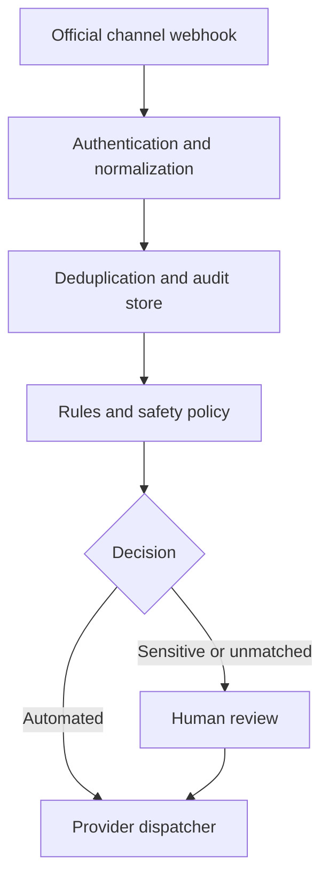

# Architecture

Moxnox Omni currently uses one small process to prove the complete event path
without hiding behavior behind infrastructure. The same process serves a small
internal cockpit. Interfaces are separated so the storage and queue can be
replaced without changing channel or policy code.

## Boundaries

- `src/domain`: provider-neutral events, policy decisions and response pipeline.
- `src/channels`: outbound provider protocol adapters.
- `src/cockpit`: dependency-free internal operator interface.
- `src/infra`: replaceable persistence and work queue.
- `src/lib`: small security and HTTP primitives.
- `src/app.js`: transport routes and authentication.

Inbound events receive an internal `accountKey` after provider authentication.
Rules may target that stable key instead of depending on provider IDs, keeping
Capital do Engano, `@ogustavosouzapauli` and WhatsApp copy separate.

Runtime rule changes are stored atomically in `DATA_DIR/automations.json`; the
packaged automation file is used only as the first-start seed. Message
classifications are appended to the JSONL audit trail. The latest manual value
is shown as the effective catalog state, while automatic sales, support and
sensitive suggestions remain reproducible from the original event.

## Scale path

The append-only JSONL store and in-process queue are intentional v0.1 adapters.
Before multi-instance production, replace them with PostgreSQL and a durable
queue, add per-tenant encryption keys, rate limits, migrations, backups and
delivery reconciliation. The domain API should stay stable while those adapters
change.
